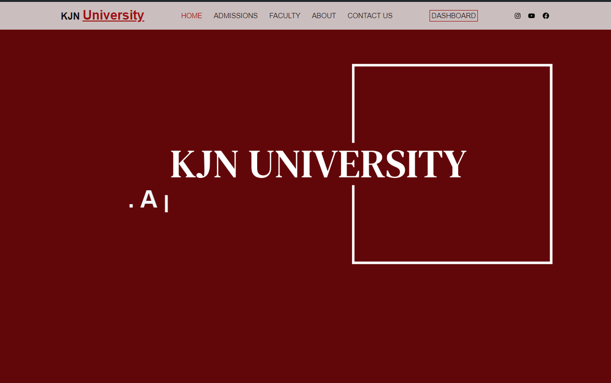
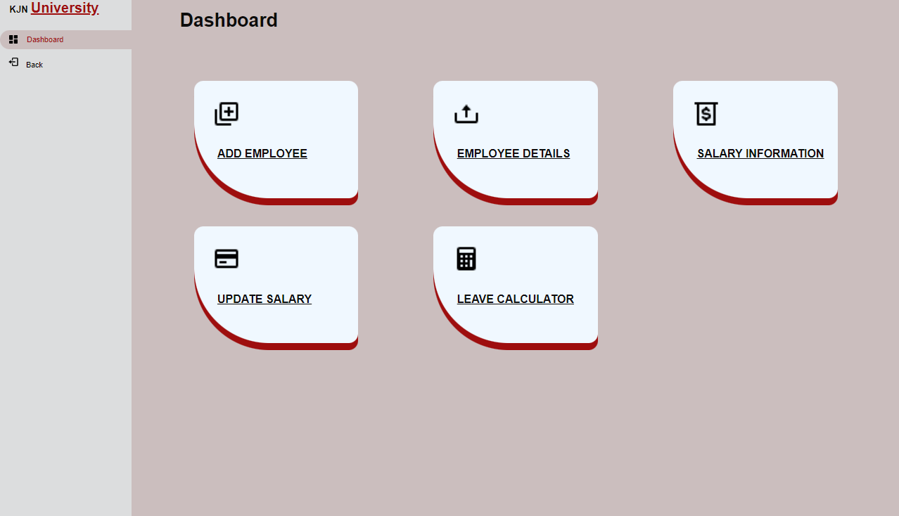
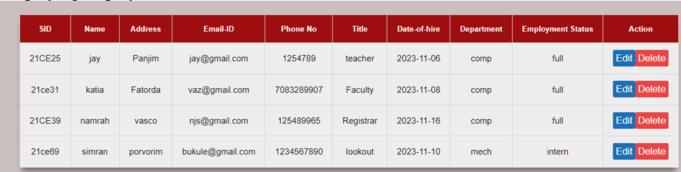
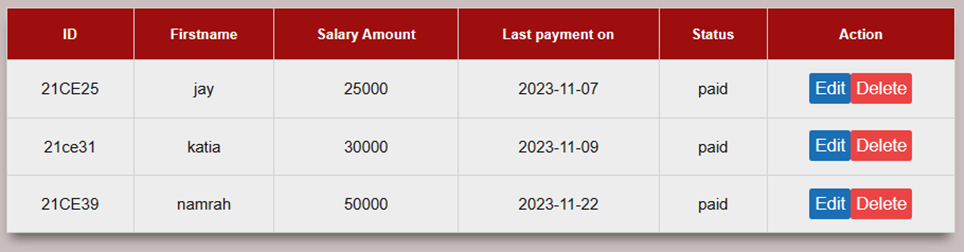
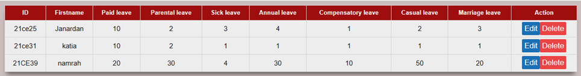
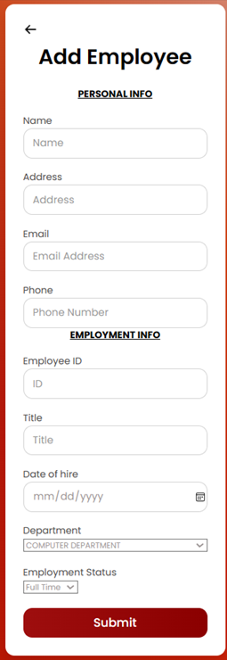
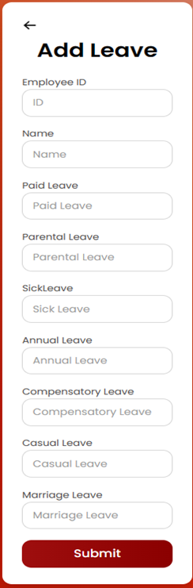
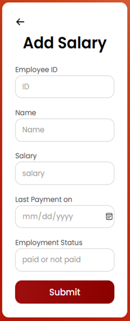

<h1 align="center">University Management system</h1>
<h3 align="center">The University Management System (UMS) is a comprehensive web-based application designed to streamline and automate various administrative  processes within a university
 
Developed using a combination of HTML, CSS, JavaScript, PHP, and supported by the XAMPP database, this project aims to enhance efficiency and organisation in managing academic and administrative tasks. 
Was responsible for the backend connection to the database and adding functionalities such as Add , Remove , Edit etc. records of various employees. 
</h3>

 

<h2>Displaying employee details</h2>

<h2>Displaying salary details</h2>

<h2>Displaying leave details</h2>

<h2>Forms</h2>

